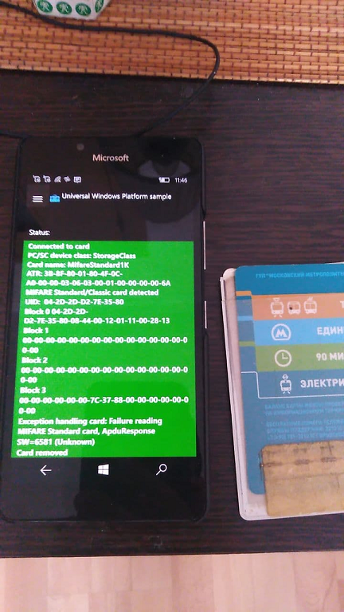

# NFC: Near field communication sample

## Description 

Shows how to implement an NFC HCE (Host Card Emulation) tap+pay application. 
Also shows how to communicate with a smart card or NFC tag.

## Screenshots

## System requirements

**Hardware:** Compatible NFC device (Lumia 830/730/640 and newer for phone)

**Phone os:** Windows 10 Mobile

## Description
This repository is NFC App prototype (draft, sketch) made with Xamarin Forms tech specially for Android system. 
(the original source code was the Troika Dumper, the nativ Android application on Java). 
This app cannot write data, but reads some important parameters: the UID, balance of transport card, etc.
Please note: this is only technology prototype, my result of NFC-on-Android micro-RnD. 

# Contribute!
There's still a TON of things missing from this proof-of-concept (MVP) and areas of improvement 

With best wishes,

  [m][e] 2021

## Thanks!
I wanted to put down some thank you's here for folks/projects/websites that were invaluable 
for helping me get this project into a functional state:
- [Microsoft UWP Samples](https://docs.microsoft.com/samples/microsoft/windows-universal-samples/) Good (but too late, heh!) example of NFC UWP app, by Microsoft!)

NFC is RnD project only. AS-IS. No support. Distributed under the MIT License.

